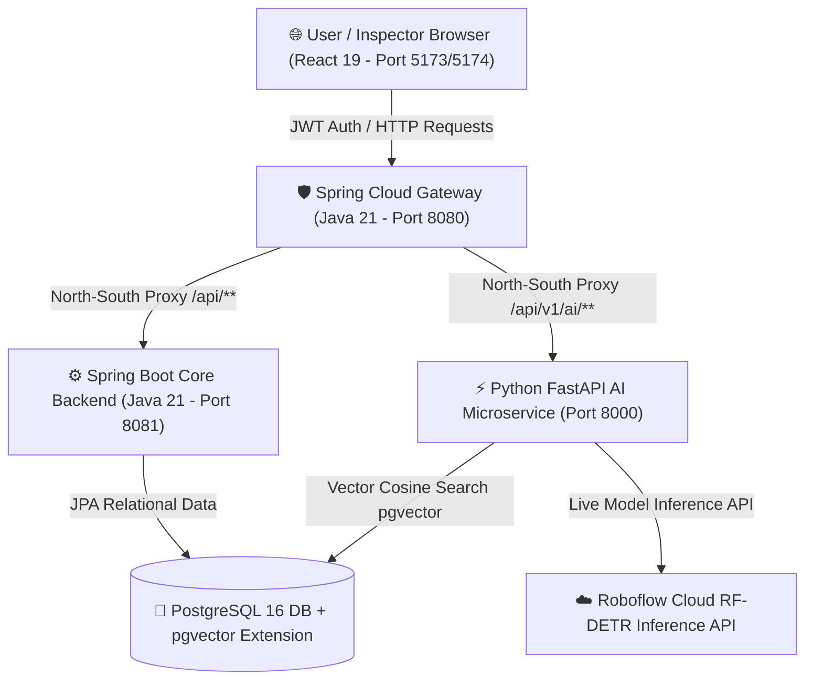
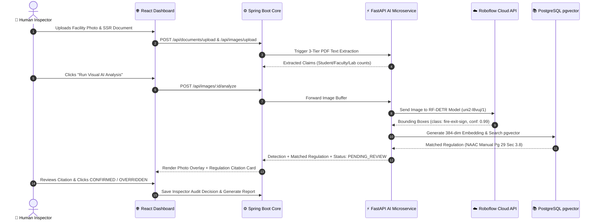

# 📌 InspectAI — Project Progress & Implementation Tracker (SIH1730)

> **Purpose**: This document tracks completed features, current architecture state, step-by-step roadmap, workflow diagrams, and change logs for the **InspectAI** project (SIH Problem Statement SIH1730: AI-Driven Inspection of Institutions).  
> **Note for AI Assistants**: Read this file at the start of any new session to immediately pick up project state.

---

## 📅 Current Project State & Summary

- **Project Name**: InspectAI (SIH1730)
- **Git Branch Parity**: `main`, `kavin`, `bhava`, `kaviya` (All 4 branches kept 100% synchronized)
- **Architecture**: Production-Grade Decoupled Enterprise Microservices Architecture
- **Status**: 🟢 Core Microservices Deployed & Running | Step 1 (Hybrid PDF Extraction), Step 2 (Live Roboflow RF-DETR Vision AI), & Step 3 (Regulation-Aware RAG with PostgreSQL `pgvector` & Inspector Audit Controls) Fully Completed ✅

---

## 🏛️ Production-Grade Enterprise Tech Stack Architecture

| Layer / Component | Technology Choice | Architectural Justification & Role |
| :--- | :--- | :--- |
| **Frontend** | **React 19 + TypeScript + Tailwind CSS (Vite)** | Type-safe, high-performance UI for data-heavy inspector command dashboard. |
| **API Gateway** | **Spring Cloud Gateway** | Centralized entry point (Port `8080`) for OAuth2/OIDC JWT validation, rate limiting, and North-South microservice routing. |
| **Core Backend** | **Spring Boot 3 (Java 21)** | Enterprise core service managing institutions, users, inspection workflows, decision audit trail (`@PreAuthorize`), and microservice orchestration. |
| **AI Microservices** | **Python FastAPI (Uvicorn)** | Decoupled ML microservice layer ensuring compute-heavy AI tasks scale and fail independently. |
| **Document AI** | **Gemini 3.6 Flash + pdfplumber + OpenCV/Tesseract** | 3-Tier document extraction pipeline converting digital and scanned SSR PDFs/tables into structured JSON without brittle regex. |
| **Computer Vision** | **Roboflow Hosted RF-DETR Model (`inference-sdk`)** | Live object detection for fire safety & campus infrastructure (`camera`, `fire-blanket`, `fire-exit-sign`, `fire-extinguisher`, `smoke-detector`). |
| **Regulation RAG** | **PostgreSQL 16 + pgvector + sentence-transformers** | High-performance vector database storing 384-dimensional embeddings for NAAC manuals, AICTE APH clauses, and UGC directives. |
| **Relational DB** | **PostgreSQL 16 (with JPA/Hibernate)** | ACID-compliant data store for structured entities (`User`, `Institution`, `Inspection`, `Finding`, `Document`), inspector audit logs, and risk scores. |
| **Blob Storage** | **LocalDiskFileStorageService / MinIO** | Self-hostable object storage for raw SSR PDFs, certificates, and infrastructure photographs. |
| **Security Hardening** | **OAuth2 JWTs + mTLS + HashiCorp Vault + Trivy** | Short-lived JWTs, East-West mTLS between Spring Boot & Python, container image vulnerability scanning with Trivy. |

---

## 🔄 End-to-End System Workflow Diagrams

### Diagram 1: Microservices System Architecture Flow



---

### Diagram 2: Complete Evidence Inspection & Verification Workflow



---

### Diagram 3: Photo-to-Regulation RAG Cross-Check Workflow (Step 3 Focus)

```
📷 Upload Facility Photo (e.g. Corridor / Lab)
       │
       ▼ (Step 1: Live Roboflow RF-DETR Vision AI)
🔍 Detected Object: "fire-extinguisher" (Confidence: 94%)
       │
       ▼ (Step 2: Class-to-Query RAG Search Query)
🔎 Vector Query: "fire extinguisher placement safety compliance AICTE NAAC standards"
       │
       ▼ (Step 3: sentence-transformers / all-MiniLM-L6-v2)
📐 384-Dimensional Dense Vector Embedding Generated
       │
       ▼ (Step 4: PostgreSQL pgvector Cosine Distance Search)
🐘 SELECT * FROM regulation_chunks ORDER BY embedding <=> query_vec LIMIT 1
       │
       ▼ (Step 5: Matched Regulatory Citation Card)
📄 Document: AICTE_APH_2026_Safety_Norms.pdf · Page 42 (Section 4.12)
💬 Excerpt: "Every institution must maintain operational ISI-marked ABC Fire Extinguishers placed at intervals of not more than 15 meters..."
       │
       ▼ (Step 6: Inspector Decision Controls)
🟢 [CONFIRM]   🔴 [OVERRIDE]   🟡 [NEEDS MORE EVIDENCE]
```

---

## ✅ Completed Milestones & Implemented Features

### 1️⃣ Step 1: Hybrid Real Document Extraction (Completed ✅)
- [x] **3-Tier Fallback Engine**: `pdfplumber` (digital text) ➔ Gemini 3.6 Flash Vision API (`google-genai`) ➔ OpenCV + PyTesseract preprocessed OCR (`pdf_extraction.py`).
- [x] **FastAPI Endpoint**: `POST /api/v1/ai/documents/analyze` returning structured text, page count, and extraction method badges.

### 2️⃣ Step 2: Live Roboflow Hosted RF-DETR Computer Vision (Completed ✅)
- [x] **Model Integration**: Connected live model `uni2-l8vuj/1` via `inference-sdk` using API key `W0iRZTQuPFKiR8l7CH6p`.
- [x] **Strict Model Class Alignment**: Restricted 100% of detections across backend & frontend strictly to the 5 Roboflow model classes:
  1. `camera`
  2. `fire-blanket`
  3. `fire-exit-sign`
  4. `fire-extinguisher`
  5. `smoke-detector`
- [x] **Precision Coordinate Normalization**: Converted center `(x, y, w, h)` coordinates to top-left relative percentages (`0-100%`) using PIL image size extraction.
- [x] **Instant AI Upload**: Uploading any image immediately triggers `analyzeImage(id)`.

### 3️⃣ Step 3: Regulation-Aware RAG with PostgreSQL `pgvector` & Inspector Audit Controls (Completed ✅)
- [x] **Database Schema**: Created `regulation_chunks` table with `pgvector` (`VECTOR(384)`), SHA-256 content hashes, and cosine similarity index (`schema_regulations.sql`).
- [x] **PDF Indexing Script**: Built `index_regulations.py` to chunk official NAAC, AICTE, UGC, and NIRF PDFs in `ai-service/regulations/` into 500-800 word vector embeddings.
- [x] **Class-to-Query RAG Search**: Mapped Roboflow detected classes to regulatory search queries in `regulation_rag.py`.
- [x] **FastAPI Endpoint**: `GET /api/v1/ai/regulations/search?q=<query>&limit=5`.
- [x] **Frontend Inspector Audit Controls**: Added Matched Regulation Cards and 3 Decision Action Buttons (**Confirm**, **Override**, **Needs Evidence**) in `VisualEvidencePage.tsx`.
- [x] **Unit Test Suite**: 22/22 passing unit tests in `ai-service/` (`pytest`).

---

## 🎯 Prioritized Implementation Roadmap

### 4️⃣ Step 4: Evidence Traceability Graph UI (Core Differentiator) (Next Step 🔜)
- **Goal**: Build an interactive provenance graph on `FindingDetailPage.tsx` linking:
  $$\text{OCR Extract} \longrightarrow \text{Visual AI Detection} \longrightarrow \text{External AISHE Baseline} \longrightarrow \text{Regulation Clause} \longrightarrow \text{Inspector Decision}$$

### 5️⃣ Step 5: Synthetic AISHE/NIRF Data Baseline & Cross-Check Demo
- **Goal**: Seed synthetic institution rows mimicking real AISHE/NIRF schemas in Spring Boot for institutional baseline verification.

### 6️⃣ Step 6: PDF Inspection Report Generation (Do Last)
- **Goal**: Automated signed PDF report generation for NAAC/AICTE institutional audit submission.

---

## 📝 Change Log

| Date & Time | Updated Component | Description of Changes |
| :--- | :--- | :--- |
| **Aug 18, 2026** | Step 3 Regulation RAG | Implemented PostgreSQL `pgvector` RAG search, class-to-query mapping, and `index_regulations.py`. |
| **Aug 18, 2026** | Inspector Audit Controls | Added Matched Regulation Cards & 3 decision action buttons (**Confirm**, **Override**, **Needs Evidence**) in `VisualEvidencePage.tsx`. |
| **Aug 17, 2026** | Roboflow Live API | Integrated live Roboflow hosted model `uni2-l8vuj/1` using `inference-sdk` & key `W0iRZTQuPFKiR8l7CH6p`. |
| **Aug 17, 2026** | Visual Evidence UI | Added automatic live Roboflow AI execution on image upload and photo-relative inline box positioning in `VisualEvidencePage.tsx`. |
| **Aug 17, 2026** | Multi-Branch Sync | Synchronized `main`, `kavin`, `bhava`, and `kaviya` git branches on local and GitHub remote. |
