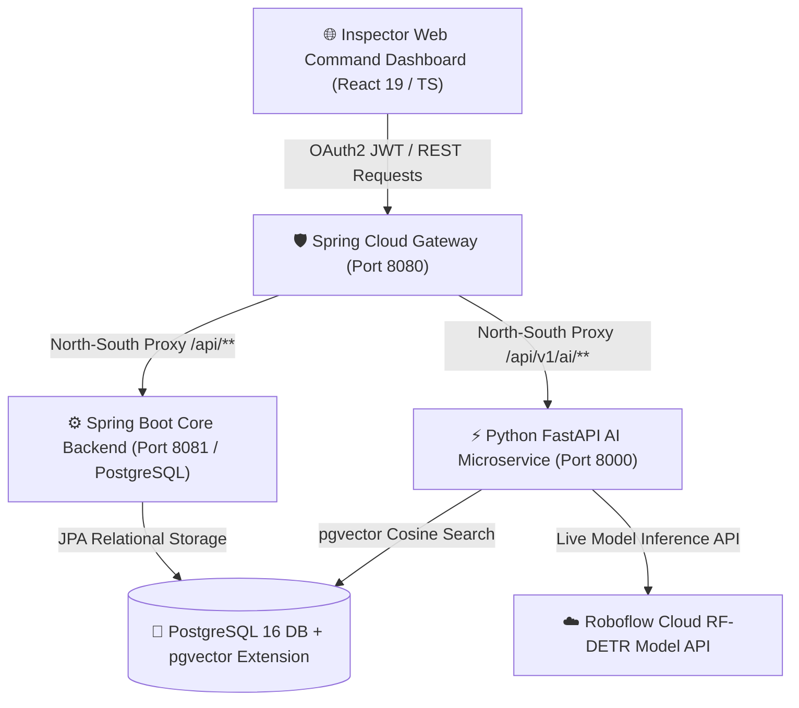

# UNI-INSPECTION
## AI-Assisted Evidence-Traceable Institutional Inspection Platform (SIH1730)

> **"AI suggests. Evidence explains. Inspector decides."**

UNI-INSPECTION is an enterprise-grade microservice platform for AI-assisted inspection and verification of higher educational institutions in India. Designed for **Smart India Hackathon (SIH Problem Statement SIH1730)**, it focuses on evidence traceability, cross-verification, live computer vision, regulation-aware RAG, and human-in-the-loop audit trail verification.

---

## 🔄 End-to-End Inspection & RAG Workflow Diagrams

### Microservices System Flow



---

### Photo-to-Regulation RAG Workflow

```
📷 Upload Infrastructure Photograph (e.g. Corridor / Laboratory)
       │
       ▼ (Step 1: Roboflow RF-DETR Vision AI Inference)
🔍 Object Detected: "fire-extinguisher" (Confidence: 94%)
       │
       ▼ (Step 2: Class-to-Query Vector Search Mapping)
🔎 Query: "fire extinguisher placement safety compliance AICTE NAAC standards"
       │
       ▼ (Step 3: sentence-transformers / all-MiniLM-L6-v2)
📐 Generate 384-Dimensional Dense Vector Embedding
       │
       ▼ (Step 4: PostgreSQL pgvector Cosine Distance Search)
🐘 SELECT * FROM regulation_chunks ORDER BY embedding <=> query_vec LIMIT 1
       │
       ▼ (Step 5: Matched Regulatory Citation Card)
📄 Document: AICTE_APH_2026_Safety_Norms.pdf · Page 42 (Section 4.12)
💬 Rule: "Every institution must maintain operational ISI-marked ABC Fire Extinguishers..."
       │
       ▼ (Step 6: Human Inspector Decision Controls)
🟢 [CONFIRM]   🔴 [OVERRIDE]   🟡 [NEEDS MORE EVIDENCE]
```

---

## ⚡ Quick Start & How to Run

### Prerequisites
- **Node.js** 18+ and **npm**
- **Java 21 (JDK 21)** and **Maven** (`mvn`)
- **Python** 3.10+ and **pip**
- **PostgreSQL 16**

---

### 🚀 One-Click Double-Tap Launchers

Run the automated launcher script for your operating system:

#### 🍏 macOS / 🐧 Linux:
```bash
./run.sh
```

#### 🪟 Windows:
Double-click `run.bat` or run in CMD:
```cmd
run.bat
```

> **What the launcher automatically does for you:**
> 1. ✅ Checks for Node.js, Python 3, Java 21, Maven, PostgreSQL 16, and Poppler.
> 2. ✅ Auto-provisions native PostgreSQL database `inspectai` and user `inspectai` non-interactively via `PGPASSWORD`.
> 3. ✅ Loads local `.env` configuration and prompts interactively for missing `GEMINI_API_KEY` / `ROBOFLOW_API_KEY`.
> 4. ✅ Automatically installs `npm` and `pip` dependencies if missing and sets up `ai-service/venv`.
> 5. ✅ Clears old processes bound to ports `8000`, `8081`, `8080`, and `5173`.
> 6. ✅ Boots up Python FastAPI (`8000`), Spring Boot Core (`8081`), Spring Gateway (`8080`), and React Frontend (`5173`) concurrently.
> 7. ✅ Automatically opens your default web browser to **http://localhost:5173**.

---

## 🏛️ Microservice Ports & Services

| Service | Technology | Port | Access URL |
| :--- | :--- | :--- | :--- |
| **React Frontend** | React 19 + TypeScript + Tailwind | `5173` / `5174` | **http://localhost:5173** |
| **API Gateway** | Spring Cloud Gateway | `8080` | **http://localhost:8080** |
| **Core Backend** | Spring Boot 3 (Java 21) + PostgreSQL | `8081` | **http://localhost:8081** |
| **AI Microservice** | Python FastAPI + `inference-sdk` | `8000` | **http://localhost:8000/docs** |

---

## 🎯 Core Completed AI & Inspection Capabilities

### 1. Hybrid Real Document Extraction (Step 1 Completed ✅)
- 3-Tier fallback extraction pipeline: `pdfplumber` (digital PDF text) ➔ Gemini 3.6 Flash Vision API ➔ OpenCV + PyTesseract preprocessed OCR.

### 2. Live Roboflow Hosted RF-DETR Computer Vision (Step 2 Completed ✅)
- **Model**: Roboflow RF-DETR Object Detection (`uni2-l8vuj/1`)
- **Workspace**: `civicissue-irb9x`
- **Supported Infrastructure Classes**:
  1. `camera` (CCTV Security Units)
  2. `fire-blanket` (Fire Safety Blankets)
  3. `fire-exit-sign` (Emergency Exit Signage)
  4. `fire-extinguisher` (Fire Extinguisher Cylinders)
  5. `smoke-detector` (Ceiling Smoke Detectors)

### 3. Regulation-Aware RAG Search via `pgvector` (Step 3 Completed ✅)
- **Vector Search Engine**: PostgreSQL 16 + `pgvector` extension + `sentence-transformers/all-MiniLM-L6-v2`.
- **Deduplicated Chunker**: `index_regulations.py` reads official NAAC, AICTE, UGC, and NIRF PDFs from `ai-service/regulations/` into 500-800 word vector embeddings.
- **Class-to-Query Mapping**: Detected objects automatically trigger vector queries against official AICTE/NAAC regulatory clauses.

### 4. Human-in-the-Loop Audit Decision Controls (Step 3 Completed ✅)
- Inspector decision flow with 3 interactive action buttons:
  - 🟢 **Confirm** (`CONFIRMED`)
  - 🔴 **Override** (`OVERRIDDEN`)
  - 🟡 **Needs Evidence** (`NEEDS_MORE_EVIDENCE`)

---

## 🔑 Demo Credentials

| Role | Email | Password |
| :--- | :--- | :--- |
| **Inspector** | `inspector@demo.com` | `inspector123` |
| **Inspection Admin** | `admin@demo.com` | `admin123` |
| **Institution Staff** | `staff@demo.com` | `staff123` |

---

## 📌 Multi-Branch Synchronization

All 4 project branches on local and remote GitHub (`origin`) are kept 100% synchronized:
- `main`
- `kavin`
- `bhava`
- `kaviya`

---

## 📜 License & Context

Built for the **Smart India Hackathon (SIH1730)**. Open for educational and institutional evaluation.  
*"AI suggests. Evidence explains. Inspector decides."*
